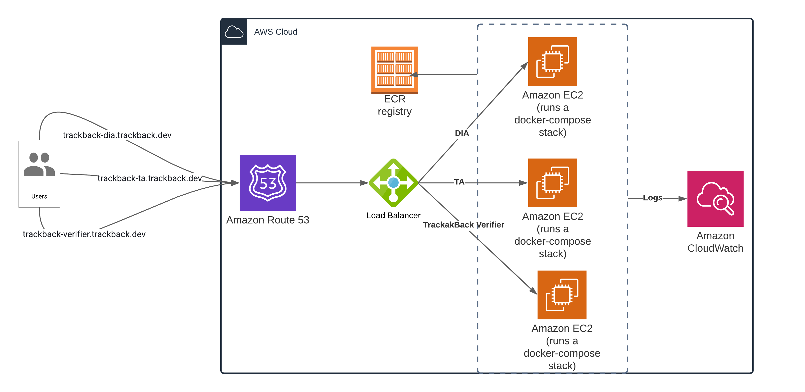

# TrackBack Verifier POC

This is a monorepo contianing verifier for POC.
This monorepo is build into a docker compose stack with a nginx front end. Please refer to `docker-compose.yml` for details

Directories

```bash

├── demo-verifier <<---- React app front end
├── demo-verifier-agent <<---- Back end api
├── nginx <<---- Reverse proxy entry point
└── terraform <<---- IAC 


```

## Build

Make sure aws cli and profile is setup. <https://docs.aws.amazon.com/cli/latest/userguide/getting-started-install.html>.

All command are in `makefile`


### Commands Summary

Create ECR repos

```bash
make ecr
```

Run localhost

Run following command and navigate to `http://localhost`

```bash
make run-trackback-dia # to run dia
make run-trackback-ta # to run ta
make run-trackback-verifier # to run verifier
```

### Build and deploy to aws



Following command will create infrasturcture and deploy to aws.

This will create 3 ecr instances and attach them to a loadbalancer.

Update Terraform Variables. `git_token` should be updated if you are using a new loadbalancer.

Create a Key/Pair called `ec2_key` in aws console.

Update following env variables if your aws environment is different

```bash
export REGION
export ECR_REPO_URL
```

```bash
make ecr build deploy
```

Redeploy command if you want to redeploy services without infrasturcture

```bash
make remotedeploy
```
